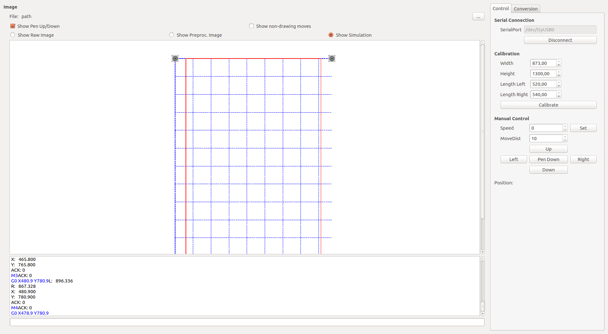
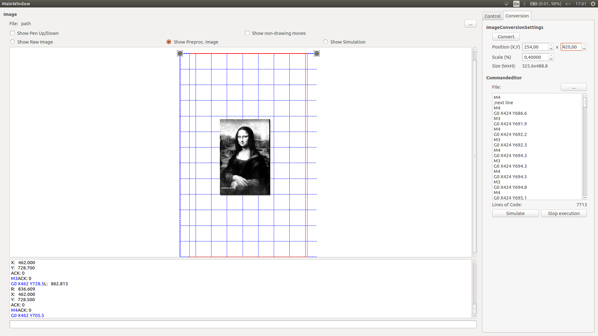
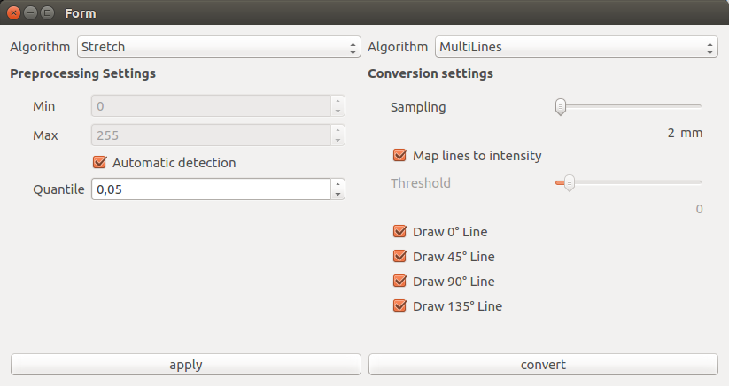

# V-Plotter Project

## Overview

# GUI
# General overview
The graphical user interface is implemented in cpp and is based on the Qt-framework. The image below shows the user interface after startup.
The interface is grouped in 4 different parts.

The center contains a virtual representation of the drawing board. The drawing area is seperated with blue dashed lines every 100 mm in x and y direction. The origin of the drawing area is located on the top left corner, on the left motor shaft. The user is able to zoom and move the camera in this virtual scene.

The bottom contains a command line window with a seperate textfield to send commands by hand to the firmware controller (Have a look at the section "G-Code-Commands" below). The command is send by pressing the enter key on the keyboard.
The console shows the sent commands in blue, responses in black and errors in red.

The right side contains a panel with two different tabs. The first tab is used for basic communication with the Arduino. It allows the connection to the specified serial device. After a sucessful connection, the groups below will get enabled. The calibration group allows the calibration of the firmware according to the current state of the machine. Please enter the correct baselength (distance between both stepper motors) and the lengths of the left and right toothed belt from the stepper motors to the pen. After pressing "calibrate", the firmware is calibrated and the virtual plotter scene is resized to the new drawing area.
Now the group below enables a manual and simple movement of the print head.

# How to convert images into drawing commands
The second tab of the control panel controls the conversation from normal images into drawing commands. It also contains a commandeditor, which shows the currently loaded command sequence.
When the user loads a new image into the software (the butten at the top with the three dots), then the image is placed in the virtual drawing area. By adjusting the image postion and scale with the spin boxes at the top, the user is able to place the picture at any desired position.

By pressing the "convert" button, a new window shows all available settings.
The settings are seperated into two individual sections: Preprocessing algorithms and conversation algorithms.

The preprocessing algorithms are used to modifiy the input image in such a way that the conversation algorithms produce prettier or different drawings compared to the raw images.
Currently the following preprocessing algorithms are implemented:
- Binarize: Converts the image into a binary image
- EdgeDetect: Detects edges on the image
- Stretch: Streteches the image intensities onto the full available colorspace to improve the contrast.

The preprocessed images is computed by pressing "apply" and the result is shown in the virtual drawing area.

After finishing the preprocessing, the user has to select a conversation algorithm.
Currently the following conversation algorithms are implemented:
- MultiLine: Draws the image by generating straight lines. The spacing between lines is controlled with the sampling parameter. The direction of the line can be selected by checking a single checkbox with one of the following values: 0°,45°,90° or 135°. The threshold parameter is a second binarization step and specifies the minimum intensity of the pixels used for the line computation. When the user selects multible line directions, there are two behaviors possible: When "map lines to intensities" is checked, the lines approximate the intensity by drawing multible times on dark regions and less on bright regions. When "map lines to intensites" is not checkt, every line type is drawn everywhere.
- Squares: This algorithm recursively seperates the image into four squares and stops when the max recursion level is reached or when there are only bright pixels in the current square left over. This generates a blocky image.

By pressing the "convert" button, the image gets converted and the computed command sequence is passed to the command editor window.

The software is now able to simulate/animate the given sequence of commands by pressing the "simulate" button in the main window.
The checkboxes above the drawingarea are able to control the rendering process. It is possible to show/hide the non-drawing moves and the pen up/down movements. With the radio buttons below, the user is able to quickly switch between the raw, the preprocessed and the converted image.

## Setup
The system consist of two stepper motors which control the draw position and a servo which controls the drawing state (drawing/not drawing).
The hardware is controlled by a Arduino Nano V3 that understands basic G-Code commands (similar to 3D-Printer-GCodes).

A host software, written in C++ with a Qt user interface sends the commands to the controller. The software is able (in the future) to convert images and SVG graphics into gcode commands. The programm then simulates the generated movements and renderes the result in a graphics scene.

## Supported G-Code-Commands

The firmware supports currently only some basic commands.
### GCode
- G0 \[X\_\] \[Y\_\]  -> Move to/add X,Y
- G28                 -> Go To Home
- G90                 -> Absolute Positioning
- G91                 -> Relative Positioning

### MCodes
- M3                  -> Move pen down (draw)
- M4                  -> Lift pen (don't draw)
- M5 B\_ L\_ R\_      -> Calibrates the hardware. Defines baselength B and left and right cord length.
- M7                  -> Debug output
- M8                  -> Get current position (X Y)
